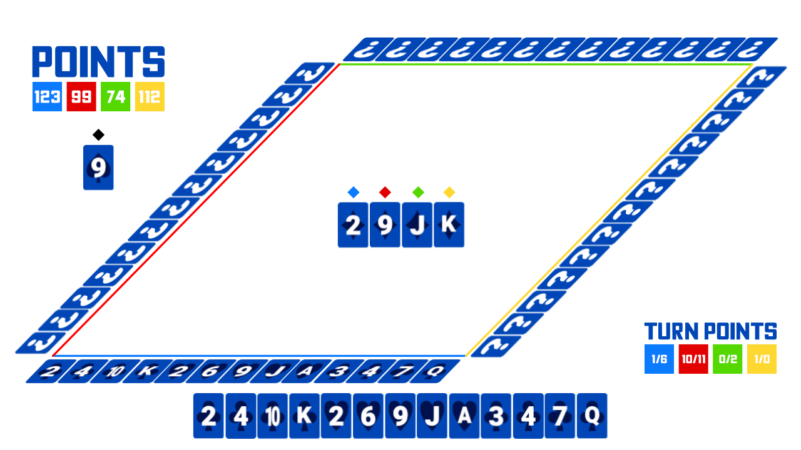

# Planning

# Film z prezentacji gry
[Youtube](https://www.youtube.com/watch?v=DiF12aFJoVU&feature=youtu.be)

## Opis gry:

**Wartości Kart (Rosnąco):**
2 3 4 5 6 7 8 9 10 Jopek Dama Król As

## Pierwsza tura - Wstęp:
Gra rozpoczyna się podzieleniem klasycznej tali kart złożonej z 52 kart na 4 graczy. Zaczyna losowo wybrany gracz (gracz albo jeden z 3 botów (ew. multiplayer)).
Na początku tury gracze określają ile wziątek wezmą (robią to po kolei)(Wziątka składa się z karty od każdego gracza{4 kart}). Ostatni gracz nie może wziąć ilości wziątek uzupełniającej ilość wszystkich możliwych wziątek.

## Pierwsza Tura - Gra:
Gracz pierwszy wyrzuca wybraną przez siebie kartę. Pozostali gracze muszą dać kartę do koloru (jeśli mają), w innym przypadku dają inną(która automatycznie przegrywa). Osoba która dała najwyższą kartę do koloru pierwszej karty zdobywa wziątkę tzw.  (pkt tury).
Wykorzystane karty są odkładane i nikt nie może ich podglądać. Osoba która zdobyła punkt wystawia teraz swoją kartę.
Tura kończy się gdy wszyscy pozbędą się kart.

## Pierwsza Tura - Koniec
Punkty do wyników doliczają się graczom którzy zdobyli tyle punktów ile początkowo planowali + 10 dodatkowych.

## Kolejne tury
W każdej kolejnej turze liczba kart przypadających na gracza jest zmniejszona o 1.
Po pierwszej turze na stole pojawia się karta - "Najlepszy kolor". Gdy nie możemy położyć karty do koloru, możemy użyć "Najlepszego koloru", który jest silniejszy niż zwykły kolor".

## Koniec Gry
W momencie kiedy w turze gracze zaczynają z 1 kartą, tura ta jest powtarzana łącznie 4 razy.
Po ostatniej z tych tur gra się kończy. Podliczane są wyniki. Wygrywa osoba z najwyższym wynikiem.

## Opis budowy
**Stół**

Obiekt na środku ekranu będący konterem par, gdzie umieszczone są karty zagrywane przez graczy w kolejności gry z oznaczonymi kolorami nad nimi. Element zawsze wyśrodkowany niezależnie od ilości kart.

**Punkty**

Obiekt znajdujący się w lewym gornym rogu. Zawiera na górze napis, i ponieżej 4 kwadraty z kolorami graczy, na które naniesione są punkty. Punkty w kwadraaach mozna resetowac, i zwiększać. Teksty w kwadratach zawsze wyśrodkowane.

**Punkty tury**

Obiekt znajdujący się w lewym dolnym rogu. Zawiera na górze napis, a poniżej 4 kwadraty z kolorami graczy, na które są naniesione punkty za wziątki, przez zaplanowaną ilość wziątek(Wymagane edytowanie stringów). Wartosci w kwadratach są stringami. Teksty w kwadratach zawsze wyśrodkowane.

**Ręka**

Karty na dole ekranu. Pojawiają się w ruchu gracza. Zawiera maksymalnie 13 kart. Karty można rzucić. Blokada kart których rzucić nie można. Element zawsze wyśrodkowany niezależnie od ilości kart.

**Dolna belka kart**
 Karty gracza. Są to te same karty co na ręce. Nie są to prawdziwe karty. Są wizualną częścią gry. Element zawsze wyśrodkowany niezależnie od ilości kart.

***Lewa, górna, prawa belka kart**
Karty botów (ew. multiplayer), wizualna cześć gry. Karty zawasze zawierają znak zapytania. Nie są to prawdziwe karty. Elementy zawsze wyśrodkowane względem środka belki niezależnie od ilości kart.

**Wybór ilości wziątek**
Element pokazujący się na środku ekranu przed rozpoczeciem tury. Zawiera na górze tekst: "Take". Pod nim znajdują się 3 kwadraty. Lewy i prawy to kolejno przyciski - i +, natomiast środkowy to ilość kart. Pod nim jest duży przycisk na szczerokosc między lewą krawędzią lewego kwadratu i prawą krawędzią prawego kwadratu z napisem ok.

**Gracz**
Intereakcja gracza z grą bedzie się odbywac przy pomocy myszki. Zadaniem gracza jest wybór kart i ewentualne ustawianie ilości wziątek.

**Boty (ew. multiplayer)**
Ilosć wziątek które wezmą boty bedzie zależeć od tury gry , siły kart bota oraz tego ile wziątek wzięły poprzednie osoby.
